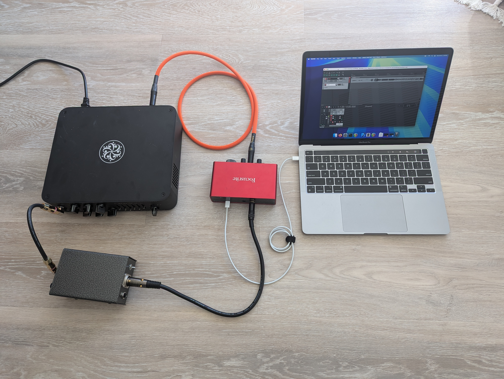
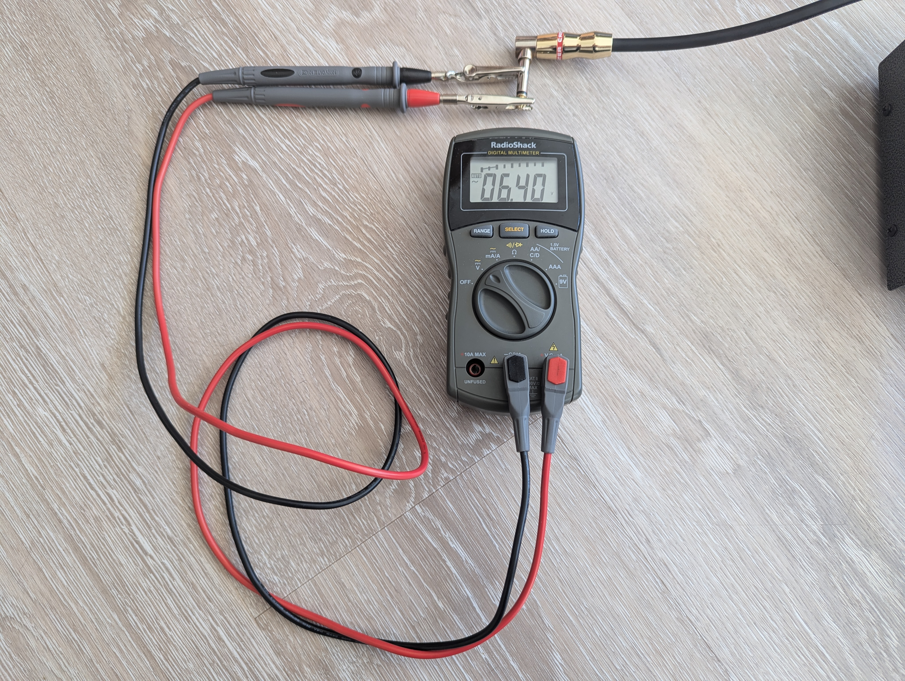
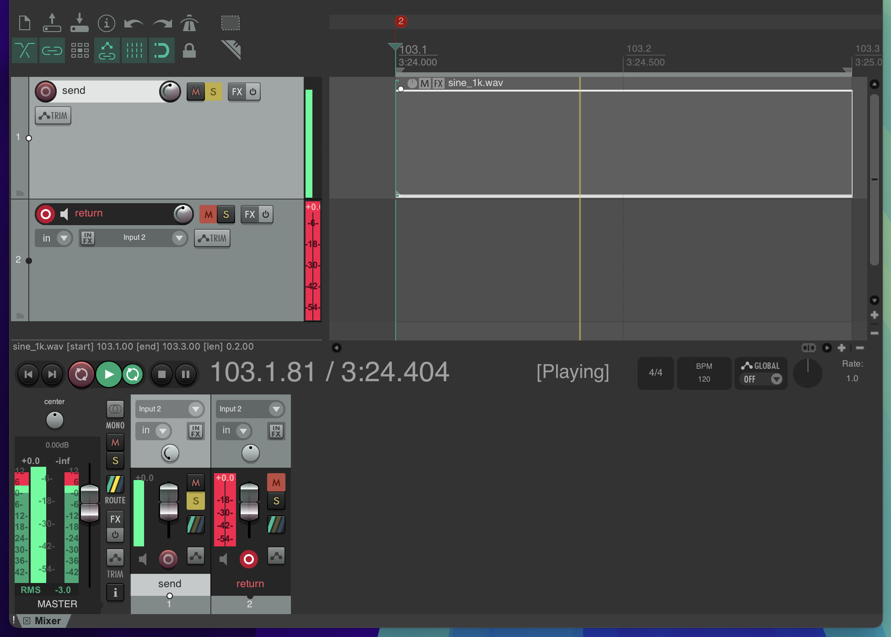
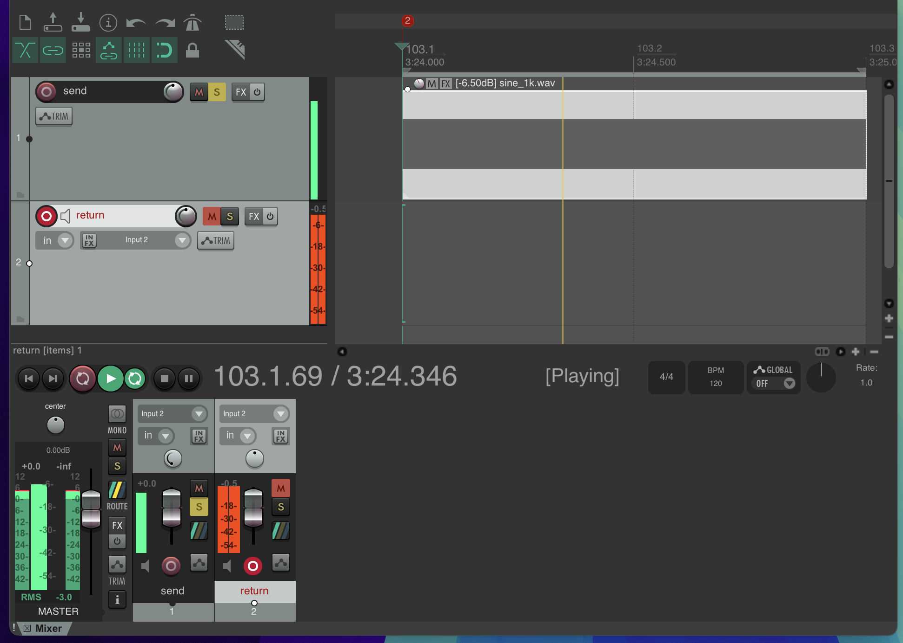
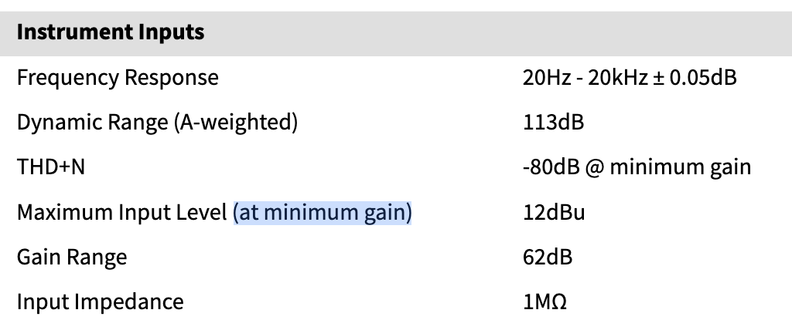
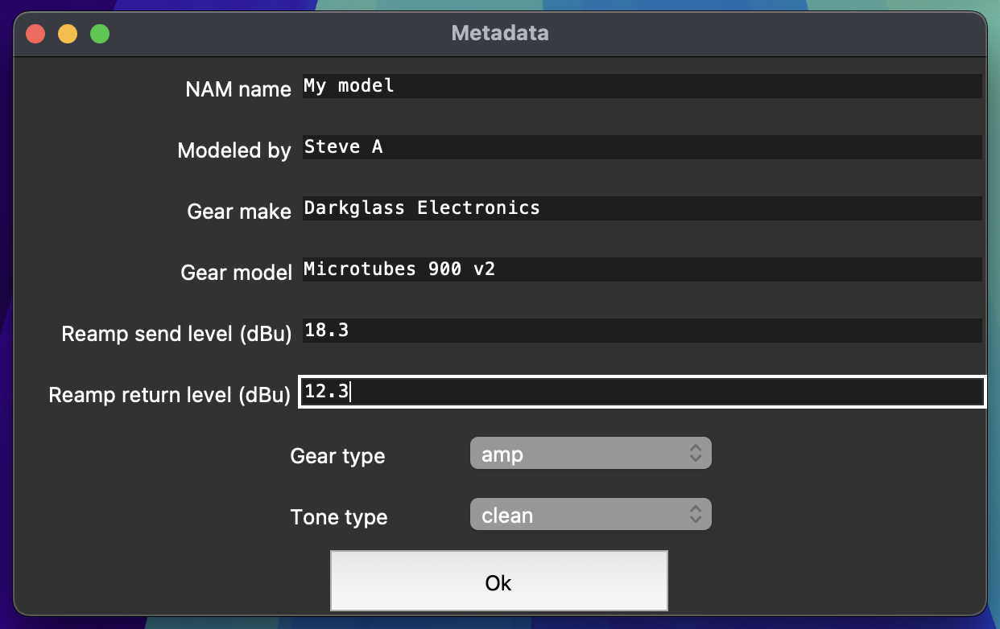

How to determine the calibration levels of your recording setup
===============================================================

Background
----------

With the arrival of highly-accurate modeling technologies like NAM, there's been
an interest in ensuring that the gain staging of the signal entering and leaving
models is accurate *in the digital realm* to what one would experience when 
plugging into the source analog gear.

As of version 0.10.0, :ref:`the NAM file spec<nam-file-spec>` defines a pair of 
metadata fields, ``"input_level_dbu"`` and ``"output_level_dbu"``, that document 
the relationship between the *digital* and *analog* signal strengths. 
Specifically, these fields record the *analog* signal strength (in dBu) that 
corresponds to the loudest signal that can be represented *digitally*. With 
these two values recorded, one can calibrate the gain staging of the digital 
models to accurately reflect the behavior of the source in its native analog 
realm.

This tutorial explains how to take the measurements to fill in these metadata.

Notes
-----

A few things before we begin:

* **As with all metadata, providing calibration levels is optional.** If you 
  don't want to do this, you can leave them blank. The models will still work in 
  any plug-in that supports playing NAMs, but the gain-staging may not be 
  accurate to the source gear.
* **Pay attention to what's in front of your model.** If you are using a model 
  with a calibrated input level, that level will *only* be correct if either (A) 
  there are no effects in front of it, or (B) any preceding effects' *input and 
  output* calibration levels are known and accounted for. This is possible to do 
  automatically within a single plug-in, but if there is *another* plug-in in 
  front of your NAM whose calibration is not known, then all bets are off!
* **You can still use your ears!** Before getting too deep into this, remember 
  that we're trying to make music. Don't let the "correct" answer get in the way 
  of making the music you *want* to make!

Tools needed
------------

In addition to your reamping gear (interface, reamp box, DI box, load 
box/microphone, cables), you're going to need to know how loud things are. In
the *digital* realm, the meters in your DAW tell you what you need to know; for 
the *analog* electrical signal, you will need a
`multimeter <https://en.wikipedia.org/wiki/Multimeter>`_.

Procedure
---------

First, set up your gear as you would normally for reamping:

* Mute the inputs to your interface in your DAW.
* Connect the output of your interface to the input of your gear via the reamp
  box.
* Connect the output from your gear (or load box, or microphone) to the input of
  your interface.
* Turn the output from your interface to its maximum value.
* Begin reamping and set the gain on the return input to your interface so that
  no clipping occurs.

*Figure: Example reamping setup. The output from the Focusrite Solo passes 
through the reamp box into the input of the amp. The (effects loop!) send from 
the amp is returned to the recording input of the interface.*

.. note:: My advice is to **set the reamping send level as high as your gear 
  will allow.** If it's too low, then the model won't see any examples of the 
  gear distorting under a very hot signal and may not predict it accurately. You 
  don't need to worry if it's exactly accurate to how loud a guitar is--that's 
  the purpose of calibration--what's important is that the model has trained on 
  examples that are at least as loud as (preferably even louder than!) how the 
  model will be used in practice.

Go ahead and reamp your gear to get the data for your model. **So long as you're 
happy with your send level and the return doesn't clip, you're good.**

From this point onwards, **do not change any hardware gain levels**. You already
recorded your data; if you make any changes, your calibration measurements won't
correspond to your data. 

Next, measure the send level. To do this, play a sine wave with 1kHz frequency
and 0dBFS peak amplitude. Some plug-ins can do tone generation, or else you can
just loop this 1-second file: 
`sine 1k.wav <https://drive.google.com/file/d/18y53y4yi_QEUundLlBZsjdY_OeytC6y1/view?usp=drive_link>`_. 
Unplug your cable from the gear you are reamping and measure the RMS voltage
across its tip and sleeve.

*Figure: Measuring the level of the jack that was plugged into the input of the 
amp. I measure 6.40 Volts RMS.*

Convert the RMS voltage to dBu using the formula:

.. math::

   \text{dBu} = 20 \times \log_{10}\left(\frac{V_{\text{RMS}}}{0.7746}\right)

Alternatively, the bottom of this page has a table of pre-computed values you
can reference. 

*Example: In the picture above, I measured 6.40 V. This corresponds to 18.3 dBu.*

Next, measure the return level. To do this, start by connecting the send from 
your interface directly to the return you used for recording. Remember, **do not
change any hardware gain levels** or else you're going to have a different 
calibration from how you recorded your data!

.. image:: media/calibration/reamp-setup-no-amp.jpg
    :scale: 15 %
    :align: center

*Figure: My reamping setup, with the send plugged directly back into the 
return.*

Play the sine tone, and note the return level (in dBFS) in your DAW:

*Figure: Monitoring the return level. The "send" track is outputting a 1 kHz 
sine tone at 0 dBFS. The return track is clipping.*

You may find that your send signal is so loud that it clips the return, like 
above. *This is not a problem.* If this happens, reduce the level of the sine 
tone in the DAW until the return doesn't clip *(You should do not change the
``input.wav`` file as well. In fact, hopefully you already reamped so that 
you're not tempted!)*

*Figure: Monitoring the return level. The "send" track is outputting a 1 kHz 
sine tone at -6.50 dBFS. The return track is measuring -0.5 dBFS.*

Note the return level (-0.5 dBFS above) and the amount by which you changed the 
sine tone's level (-6.50 dB).

To compute the return level, remember: what we are trying to do is figure out 
how loud an analog signal is (in dBu) that barely clips the return on our 
interface (i.e. achieves 0 dBFS). We know the analog level of the sine tone (at 
full volume, i.e. 0 dBFS) from above, so the formula to compute your return 
level calibration, in dBu, is:

.. math::

   \text{dBu}_{return} = \text{dBu}_{send} + \Delta - L,

where Δ is the amount by which you changed the sine tone's level, and *L* is
the observed return level in the DAW (in dBFS peak).

For example, using the numbers above, I get 
*18.3 + (-6.50) - (-0.5) = 12.3 dBu*.

Careful: The return level calibration may not be what you think it is
^^^^^^^^^^^^^^^^^^^^^^^^^^^^^^^^^^^^^^^^^^^^^^^^^^^^^^^^^^^^^^^^^^^^^

As of this writing (October 2024), some users are likely familiar with a 
manufacturer-provided calibration level for their interface's inputs. For 
example, the maximum input level for the instrument inputs on the 4th-generation
Focusrite Scarlett 18i20 is listed in its manual as 12 dBu:

*Figure: Instrument input specifications, from the manual for the* 
`Focusrite Scarlett 18i20 4th Generation <https://downloads.focusrite.com/focusrite/scarlett-4th-gen/scarlett-18i20-4th-gen>`_
*.*

This is specifically for when the interface is set to **minimum gain**; if you 
adjust (increase) the gain when recording to get a bigger waveform when 
recording, then this will *reduce* the dBu at which clipping happens. **If you 
record with your gain all the way down**, then you can use the manufacturer's
specification; but if not, then you should calculate it as above. (You may also 
find that if you compute measure it yourself, the calibration for your own 
interface's inputs may be slightly different from the manufacturer's spec.)

Providing the calibration in the metadata
^^^^^^^^^^^^^^^^^^^^^^^^^^^^^^^^^^^^^^^^^

Once you've figure out the calibration levels for your recording, you can 
provide them as metadata when making your model. Using the numbers from above, I 
would write this:

*Figure: Metadata for the local GUI-based trainer.*

A note on updating old model files
----------------------------------

If you know the levels from a model that you made previously, you can update 
old files to include this metadata. ``.nam`` files conform to the JSON file 
format and can be edited as plain text. If you want to do this, you can make a 
new model and use it as a reference for how to add the new metadata fields to 
your old files. Look for the fields ``"input_level_dbu"`` and 
``"output_level_dbu"`` in the new file and copy them to your old file in the 
corresponding location, changing the numbers as necessary. (If you only know 
one, then you can leave the other as `null`.) As always, it's recommended to 
save a backup of your file before you being editing it in case you make a 
mistake.

Appendix: Conversion table between RMS voltage and dBu
------------------------------------------------------

+-----------------+-----------------+
| RMS Voltage (V) | dBu             |
+=================+=================+
| 0.8             | 0.0             |
+-----------------+-----------------+
| 0.9             | 1.0             |
+-----------------+-----------------+
| 1.0             | 2.0             |
+-----------------+-----------------+
| 1.1             | 3.0             |
+-----------------+-----------------+
| 1.2             | 4.0             |
+-----------------+-----------------+
| 1.3             | 4.5             |
+-----------------+-----------------+
| 1.4             | 5.0             |
+-----------------+-----------------+
| 1.5             | 6.0             |
+-----------------+-----------------+
| 1.6             | 6.5             |
+-----------------+-----------------+
| 1.7             | 7.0             |
+-----------------+-----------------+
| 1.8             | 7.5             |
+-----------------+-----------------+
| 1.9             | 8.0             |
+-----------------+-----------------+
| 2.1             | 8.5             |
+-----------------+-----------------+
| 2.2             | 9.0             |
+-----------------+-----------------+
| 2.3             | 9.5             |
+-----------------+-----------------+
| 2.4             | 10.0            |
+-----------------+-----------------+
| 2.6             | 10.5            |
+-----------------+-----------------+
| 2.7             | 11.0            |
+-----------------+-----------------+
| 2.9             | 11.5            |
+-----------------+-----------------+
| 3.1             | 12.0            |
+-----------------+-----------------+
| 3.3             | 12.5            |
+-----------------+-----------------+
| 3.5             | 13.0            |
+-----------------+-----------------+
| 3.7             | 13.5            |
+-----------------+-----------------+
| 3.9             | 14.0            |
+-----------------+-----------------+
| 4.1             | 14.5            |
+-----------------+-----------------+
| 4.4             | 15.0            |
+-----------------+-----------------+
| 4.6             | 15.5            |
+-----------------+-----------------+
| 4.9             | 16.0            |
+-----------------+-----------------+
| 5.2             | 16.5            |
+-----------------+-----------------+
| 5.5             | 17.0            |
+-----------------+-----------------+
| 5.8             | 17.5            |
+-----------------+-----------------+
| 6.2             | 18.0            |
+-----------------+-----------------+
| 6.5             | 18.5            |
+-----------------+-----------------+
| 6.9             | 19.0            |
+-----------------+-----------------+
| 7.3             | 19.5            |
+-----------------+-----------------+
| 7.7             | 20.0            |
+-----------------+-----------------+
