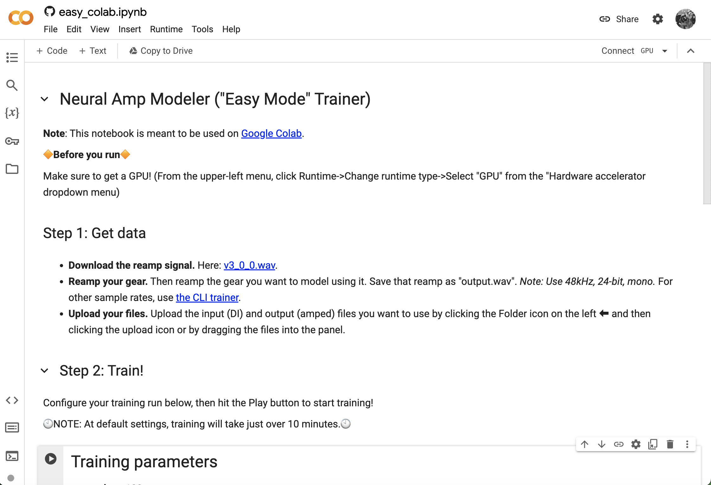
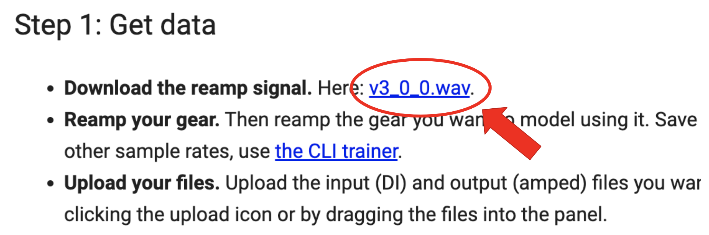
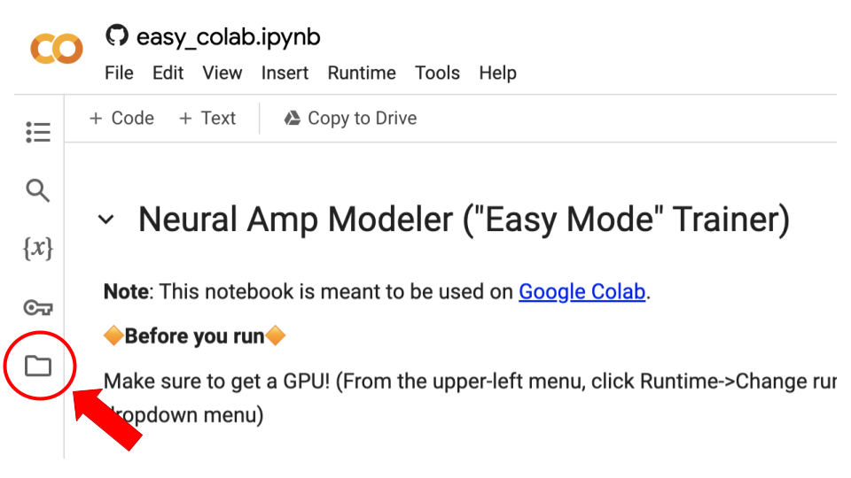
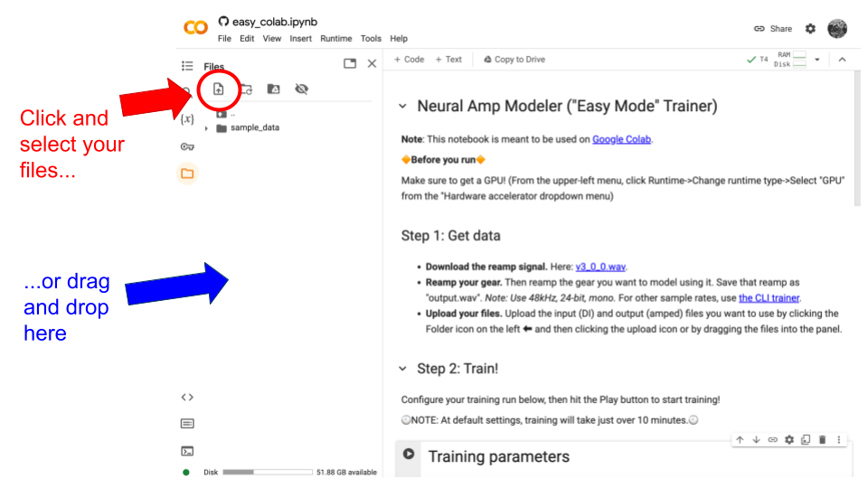
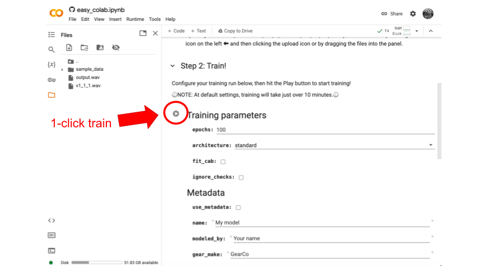
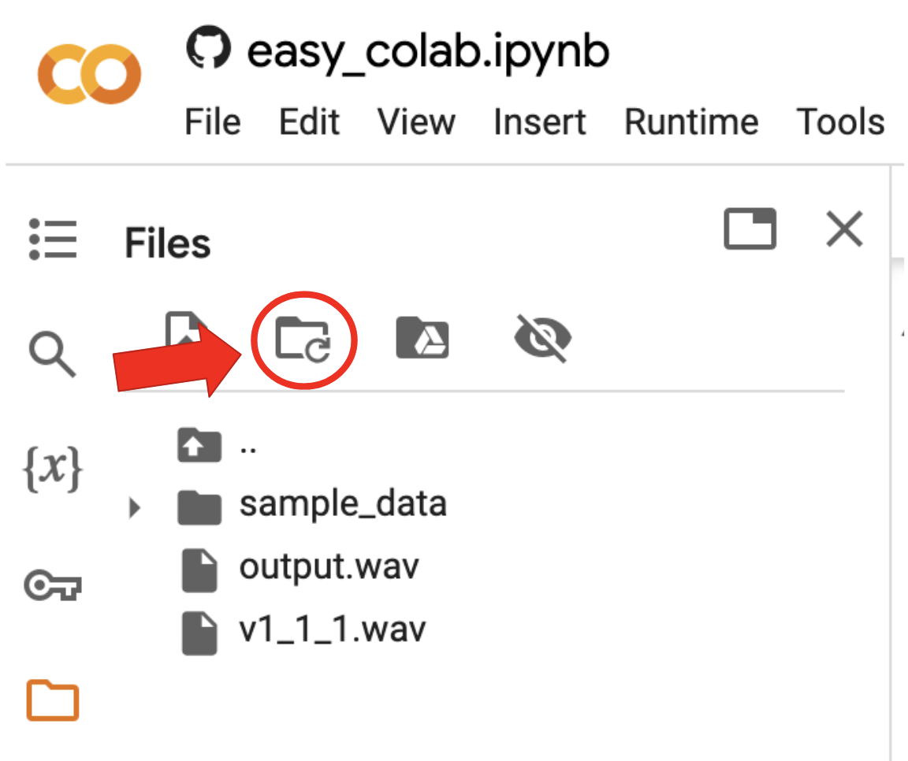

Training in the cloud with Google Colab
=======================================

If you don't have a good computer for training ML models, you use Google Colab
to train in the cloud using the pre-made Jupyter notebook at 
`notebook.ipynb <https://github.com/sdatkinson/NAMTrainerColab/blob/main/notebook.ipynb>`_, 
which is designed to be used with 
`Google Colab <https://colab.research.google.com/>`_.

Opening the notebook
--------------------

To open the notebook in Colab, follow 
`this link <https://colab.research.google.com/github/sdatkinson/NAMTrainerColab/blob/main/notebook.ipynb>`_.

.. note:: Most browsers work, but Firefox can be a bit temperamental. This isn't
    NAM's fault; Google Colab just prefers Chrome (unsurprisingly).

You'll be met with a screen like this:

Reamping: Getting data for your model
-------------------------------------

In order to train, you're going to need data, which means you're going to need 
an amp or a pedal you want to model, and you're going to need to have gear to 
reamp with it. Start by downloading the standardized test signal here:

If you need help with reamping, others 
`on YouTube <https://www.youtube.com/results?search_query=reamping+tutorial>`_
have made high-quality tutorials.

.. note:: You need to make sure that your exported file is the same length as 
    the input file. To help with this, the standardized input files are an 
    exact number of seconds long. If you drop them into a DAW session at 120 
    BPM, you can snap your guides to the beat and easily get the reamp of the 
    right length.

However, if you want to skip reamping for your first model, you can download 
these pre-made files:

* `input.wav <https://drive.google.com/file/d/1KbaS4oXXNEuh2aCPLwKrPdf5KFOjda8G/view?usp=sharing>`_, 
  a standardized input file.
* `output.wav <https://drive.google.com/file/d/1NrpQLBbCDHyu0RPsne4YcjIpi5-rEP6w/view?usp=sharing>`_, 
  a reamp of a high-gain tube head.

To upload your data to Colab, click the Folder icon here:

and either drag and drop the files into the panel or select them after clicking 
the upload button.

**Wait for the files to finish uploading before proceeding.** If you don't, then
strange errors will happen.

Training
--------

At this point, you can train your model with a single click: just click the Play
button and everything will finish in about 10 minutes.

However, there are a lot of options below that you can use to tweak the training
that are worth getting familiar with.

TODO: explain the options.

Downloading your model
----------------------

Once training is done, you can download your model as a .nam file from the file 
browser:

.. image:: media/colab/download.png
    :scale: 20 %

If you don't see it, you might have to refresh the file browser:

To use it, point 
`the plugin <https://github.com/sdatkinson/NeuralAmpModelerPlugin>`_ at the file
and you're good to go!