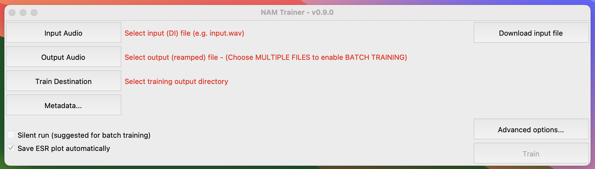
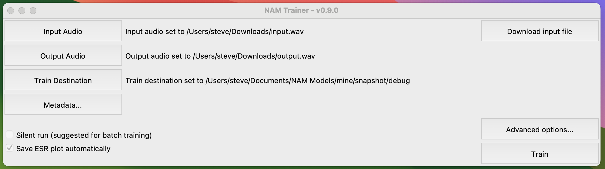
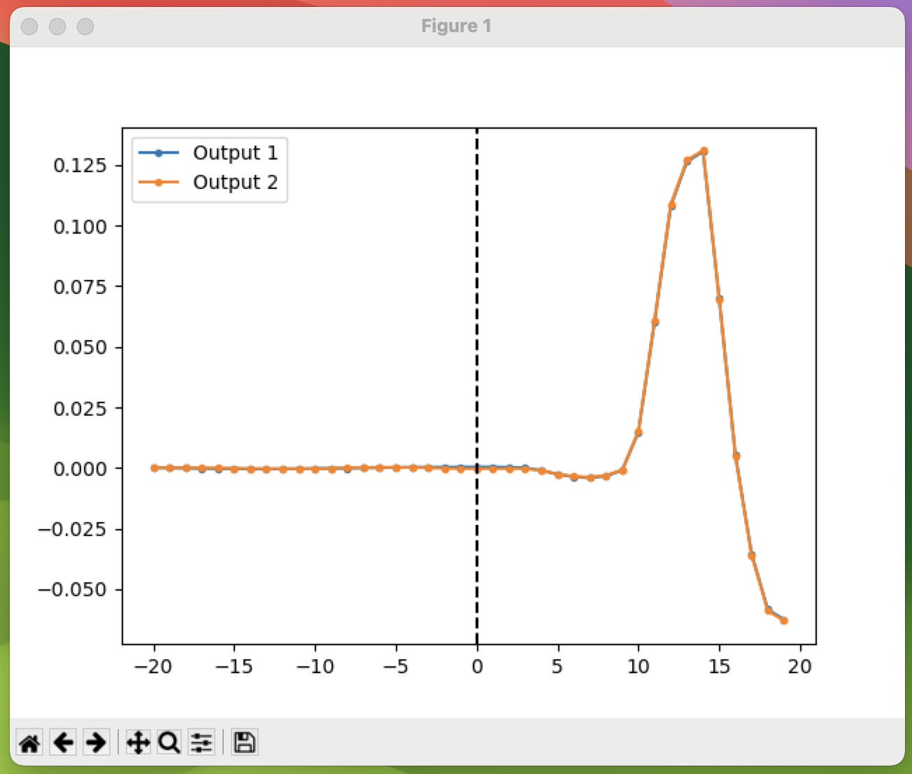
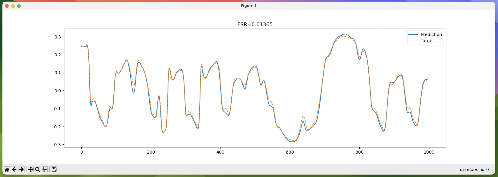

Training locally with the GUI
=============================

After installing NAM locally, you can launch the GUI trainer from a terminal 
with:

.. code-block:: console

    $ nam

You'll see a GUI like this:

Start by pressing the "Download input file" button to be taken to download the 
audio you'll reamp through your gear to make your model,
`input.wav <https://drive.google.com/file/d/1KbaS4oXXNEuh2aCPLwKrPdf5KFOjda8G/view?usp=sharing>`_.
Reamp this through the gear that you want to model and render the output as a
WAVE file. Be sure to match the sample rate (48k) and bit depth (24-bit) of the 
input file. Also, be sure that your render matches the length of the input file.
An example can be found here:
`output.wav <https://drive.google.com/file/d/1NrpQLBbCDHyu0RPsne4YcjIpi5-rEP6w/view?usp=sharing>`_.

Return to the trainer and pick the input and output files as well as where you
want your model to be saved.

.. note:: To train a batch of models, pick all of their reamp (output) files.

Once you've selected these, then the "Train" button should become available:

Click "Train", and the program will check your files for any problems, then
start training.

Some recording setups will have round-trip latency that should be accounted for.
Some DAWs might attempt to compensate for this but can overcompensate. 
The trainer will automatically attempt to line up the input and output audio. To 
help with this, the input file has two impulses near its beginning that are used
to help with alignment. The trainer will attempt to identify the response to
these in the output. You'll see a plot showing where it thinks that the output
first reacted to the input (black dashed line) as well as the two responses
overlaid with each other. You should see that they overlap and that the black
line is just before the start of the response, like this:

Close this figure, and then you will see training proceed. At the end, you'll
see a plot that compares the model's prediction against your recording:

Close that plot, and your model will be saved. To use it, point 
`the plugin <https://github.com/sdatkinson/NeuralAmpModelerPlugin>`_ at the file
and you're good to go!
